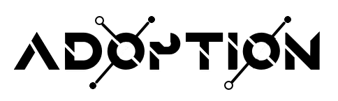

    

	<b>A dApp, blockchain and crypto agnostic React UI kit 🧰</B>
	  
	
	
	
	
	
	

---

## Installation
`npm i --save adoption`

## Try it
To see the components live, check [this storybook](https://paulfasola.github.io/adoption/).  
If you want to see them in action, you'll find project examples in the [examples](./examples/) folder.

## Contributing
TDB.

## License
Adoption is licensed under [MIT](https://github.com/PaulFasola/adoption/blob/master/LICENSE).  

## Credits

🖼 Logo font: `Anurati` by [Emmeran Richard](https://www.emmeranrichard.fr/)  
🤟 All the contributors working on the dependencies used to build this project